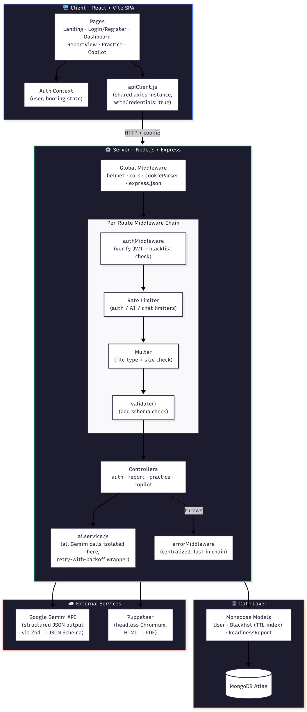
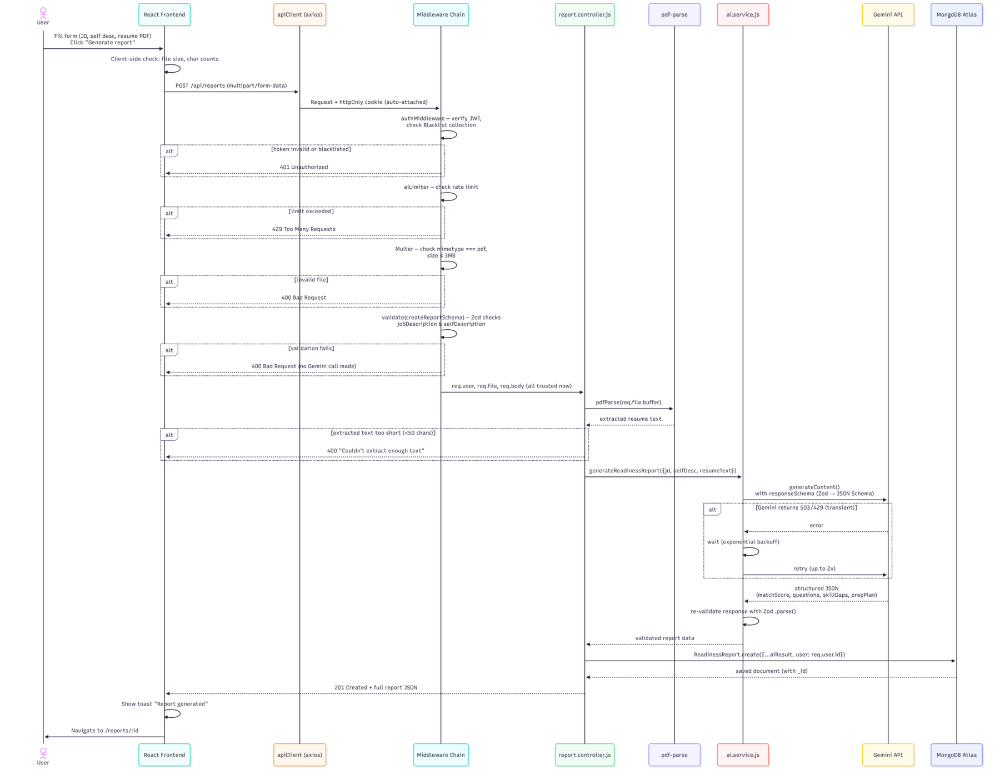
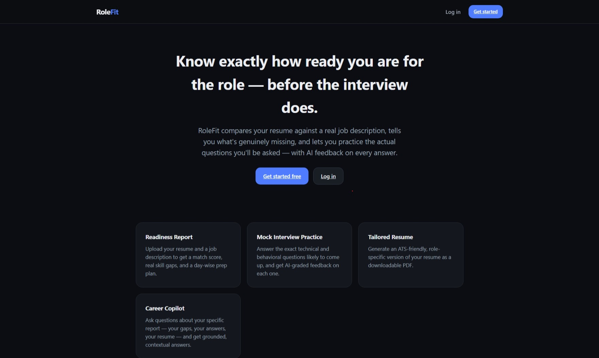
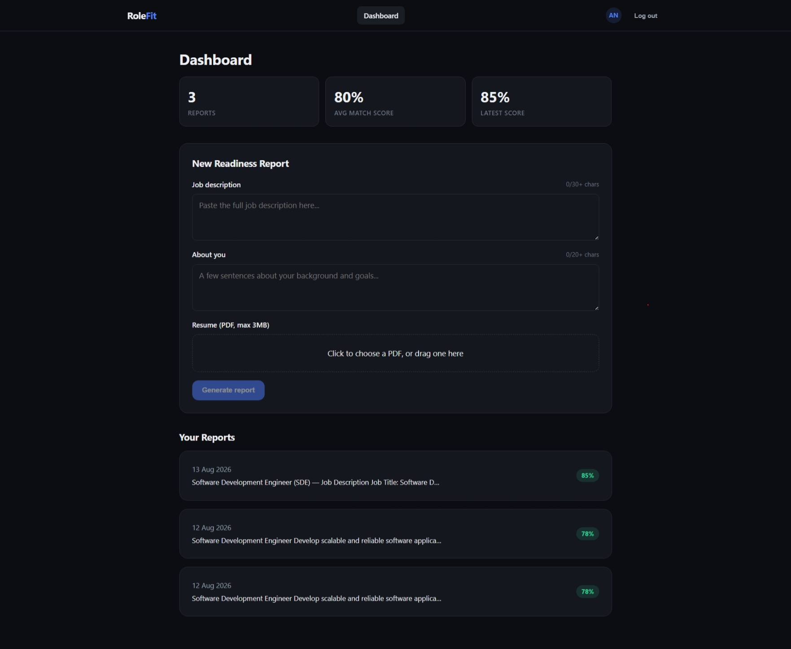
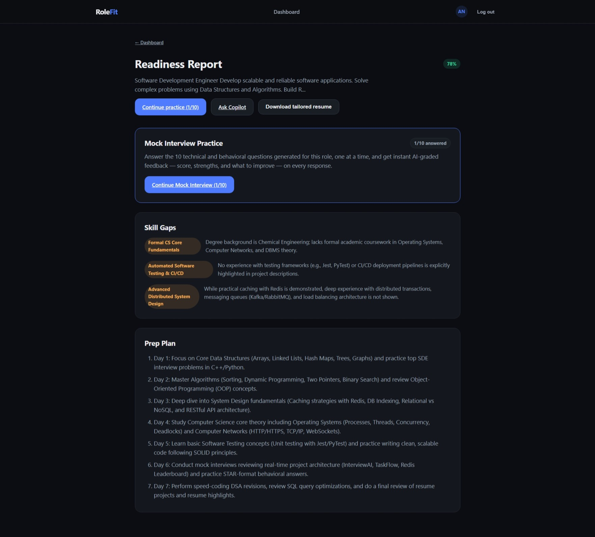
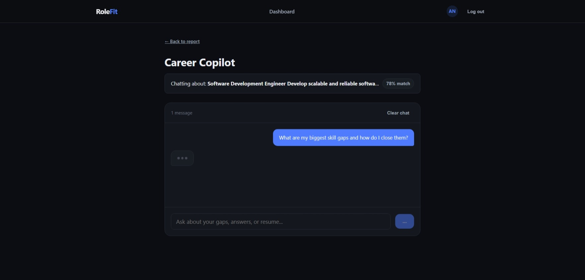

# RoleFit

RoleFit is a full-stack app that checks how well a resume matches a job description, then helps you actually prepare for the interview instead of just telling you "72% match" and leaving you there.

Upload your resume + a job description -> get a match score, likely technical/behavioral questions with model answers, skill gaps, and a day-wise prep plan. Then you can practice those exact questions and get AI-graded feedback on your answers, ask a chatbot questions about your specific report, or generate a tailored ATS-friendly resume as a PDF.

## Why I built the practice mode

Most resume-matcher tools stop at the report. You get a score, maybe some bullet points, and that's it. I wanted something I'd actually use the week before an interview, so Mock Interview Practice Mode turns the generated questions into a real practice loop - answer in your own words, get scored, see what to improve.

**Stack:** React · Vite · Node.js · Express · MongoDB Atlas · Mongoose · Gemini API · JWT · Zod · Puppeteer · Jest · Vitest

## Architecture

```
Frontend (React + Vite)              Backend (Express + MongoDB Atlas)
├─ features/marketing (landing)      ├─ routes -> middlewares -> controllers
├─ features/auth                     ├─ services/ai.service.js (Gemini)
├─ features/readiness (dashboard)    ├─ models (Mongoose)
├─ features/practice                 └─ centralized error handling
├─ features/copilot
├─ components/ (AppShell, Toast, EmptyState, ScoreBadge)
├─ style/index.css
└─ lib/apiClient.js (shared axios instance)
```

Routes: `/` (landing) -> `/login` / `/register` -> `/dashboard` (protected) -> `/reports/:id` -> `/reports/:id/practice` or `/reports/:id/copilot`. Authenticated routes all render inside a persistent nav shell so you're never stuck without a way back to the dashboard.

### Report generation flow

Resume PDF (multipart) -> Multer (in-memory, checks mimetype) -> `pdf-parse` extracts the text -> Gemini generates match score + questions + skill gaps + prep plan, constrained to a Zod schema (converted via `zod-to-json-schema` and passed as Gemini's `responseSchema`) -> validated *again* with the same Zod schema on the way back (constrained output reduces bad responses, doesn't guarantee them) -> saved to MongoDB scoped to the logged-in user.

### Practice mode flow

Pick a question -> type an answer -> backend sends `{question, idealAnswer, userAnswer}` to Gemini for grading -> score + feedback gets stored as a subdocument on the report, so progress sticks around across sessions instead of resetting every time.

### Career Copilot

Chat scoped to one specific report. Every message, the backend pulls that report's job description, resume text, match score, and skill gaps into the prompt, so it's actually answering based on your application instead of giving generic advice. History is kept client-side and resent each message (capped at the last 20) - no chat session stored in the DB, kept it simple.

## Auth

JWT in an httpOnly, sameSite=lax, secure-in-prod cookie. Logout writes the token to a Blacklist collection (JWT can't really be revoked server-side otherwise) with a TTL index so old entries clean themselves up automatically.

One trade-off worth knowing: cookie auth needs CSRF mitigation, and sameSite=lax is good mitigation but not a complete guarantee, unlike sending a token in an Authorization header (which the browser never auto-attaches cross-site). Went with cookies anyway for the httpOnly XSS protection and because it's less to manage on the frontend.

## Setup

**Backend**
```bash
cd Backend
cp .env.example .env   # MONGODB_URI, JWT_SECRET, GOOGLE_GENAI_API_KEY, CLIENT_URL
npm install
npm run dev
```

**Frontend**
```bash
cd Frontend
cp .env.example .env   # VITE_API_URL
npm install
npm run dev
```

Backend checks all required env vars on boot and exits with a clear error if something's missing, instead of starting up broken.

## Testing

Backend: Jest, focused on the security-relevant paths rather than trying to cover everything - auth middleware (missing/blacklisted/expired token rejection), the IDOR fix on report/practice/copilot controllers (a request scoped to one user can never read or act on another user's report), and Zod validation edge cases.

```bash
cd Backend && npm test
```

Frontend: Vitest, covering pure logic (score-color boundary values, the Copilot chat history truncation logic that fixed a real validation bug during development).

```bash
cd Frontend && npm test
```

Both run in CI on every push/PR (`.github/workflows/ci.yml`), plus a build check for both apps.

## Security stuff I paid attention to

- httpOnly/secure/sameSite cookie
- bcrypt for passwords
- Zod validation on every endpoint that mutates data, before it touches the DB or calls Gemini
- Ownership checks on report/PDF lookups - originally any logged-in user could grab another user's report just by knowing the ID (IDOR), fixed by scoping every query to the requesting user
- Multer checks file type + size on resume upload
- Rate limiting, tighter on the AI-calling routes since those cost actual money per request
- `helmet` for the usual security headers
- One error handler for the whole app - logs the real error server-side, never leaks internals in the response
- `trust proxy` set explicitly - matters once this is deployed behind a reverse proxy (Render/Railway/etc), otherwise rate limiting sees every request as coming from the proxy's IP and `secure` cookies never register as HTTPS
- Graceful shutdown on SIGTERM/SIGINT - finishes in-flight requests and closes the DB connection cleanly instead of dropping requests on every redeploy

## Known limitations

- No refresh tokens, session just expires after `JWT_EXPIRES_IN`
- Practice grading is one-shot, no follow-up questions from the AI
- No resume version history, each report just stores its own copy of the resume text
- Copilot chat isn't persisted - refresh the page and it's gone (the report itself is fine, just the conversation)

## Screenshots
### Architecture



### Report Generation Flow



### Landing Page


### Dashboard


### AI Readiness Report


### Career Copilot

